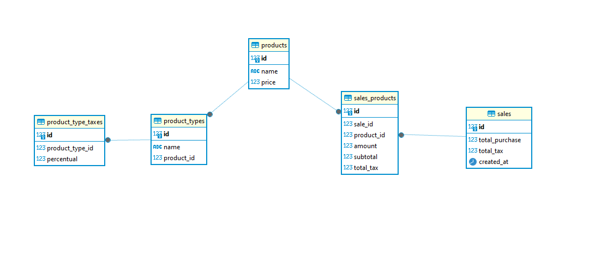
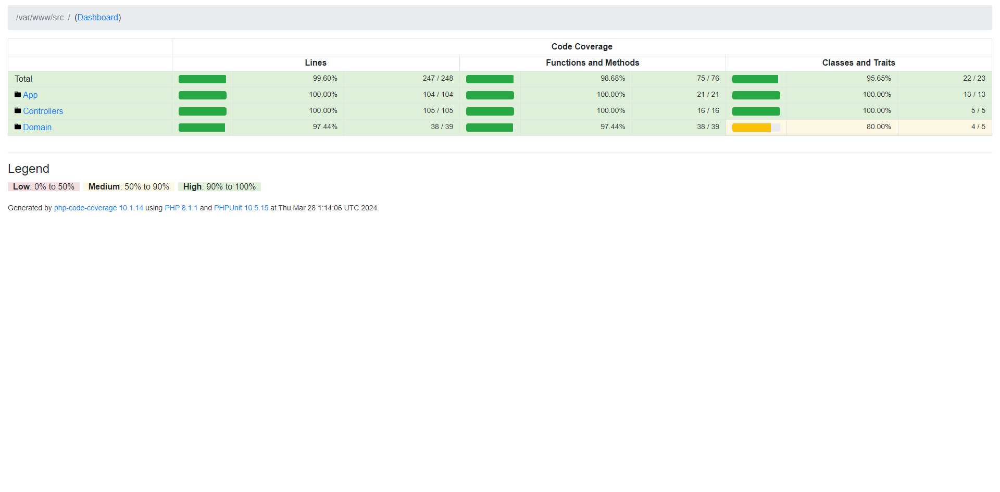

# Backend

## Como Executar Com Docker

Utilizei o docker para subir os serviços necessários, assim não é preciso realizar o restore do banco de dados. Caso tenha o docker instalado basta:

Clonar este projeto em algum diretório e mudar para pasta backend

```console
cd backend
```
O arquivo .env já esta com as credenciais necessárias para conectar ao banco de dados, caso seja necessário ajuste-os

Execute o docker container

```console
docker-compose up -d
```

A aplicação estará disponível em

```console
http://localhost:8080/
```
## Como Executar Sem Docker

Necessário ter PHP instalado e o postgres.

Ajustar o .env para as credenciais necessárias conforme seu banco de dados.

Fazer o dump da base de dados, o arquivo está na raiz do projeto backend (dump.sql)

Usar o servidor nativo do PHP

```console
php -S localhost:8080
```

A aplicação estará disponível em

```console
http://localhost:8080/
```

## Como resvolvi o problema

Para o banco de dados dividi as tabelas da seguinte forma:

<p align="center">
    
</p>

Para a codificação, criei uma API HTTP simples, segui princípios da arquitetura limpa, focando assim em uma melhor separação das responsabilidades entres as diferentes camadas da aplicação.

<ul>
    <li><b>Entity</b>: representam os objetos de domínio do sistema, abstrações dos conceitos centrais da aplicação</li>
    <li><b>Use Cases</b>: responsáveis por conter a lógica de negócio da aplicação. Eles recebem dados dos controllers, coordenam as operações necessárias e interagem com os repositórios para acessar os dados</li>
    <li><b>Controllers</b>: validam os dados das requisições HTTP e chamam os casos de uso apropriados</li>
    <li><b>Infraestrutura</b>: responsável por fornecer acesso aos recursos externos, como banco de dados </li>
    <li><b>Repositórios</b>: responsáveis por abstrair o acesso aos dados da aplicação. Eles implementam interfaces definidas na camada de domínio e fornecem métodos para recuperar, armazenar e manipular objetos de domínio. </li>
    <li><b>Factories</b>: responsável por criar instâncias de objetos complexos</li>
    <li><b>Injeção de dependências</b>: são injetadas por meio do construtor, permitindo assim que diferentes implementações possam ser facilmente substituídas.</li>
</ul>

### Testes automatizados

Criei testes automatizados, focando nos unitários, estão na raiz dentro de /tests.

Para executar, basta conectar ao container:

```console
docker compose exec market-expert-app bash
```

Executar 

```console
./vendor/bin/phpunit
```

<p align="center">
    
</p>


## Rotas da API

### Criação de produtos [POST /products]

+ Request (application/json)
   + Body

            {
                "name": "Teste",
                "price": 10
            }

+ Response 201 (application/json)
    + Body

            []

### Busca de produtos [GET /products]

+ Request (application/json)

+ Response 200 (application/json)
    + Body

           [
                {
                    "id": 1,
                    "name": "Teste 1",
                    "price": 10.99
                },
                {
                    "id": 2,
                    "name": "Teste 2",
                    "price": 50
                },...
           ]

### Busca de produto por {ID} [GET /productsById?product_id={ID}]

Substituir {ID} pelo productId

+ Request (application/json)

+ Response 200 (application/json)
    + Body

            {
                "id": 1,
                "name": "Teste 1",
                "price": 10.99,
                "total_percentage_tax": 660
            }

### Criação de tipo de produto [POST /product-types]

Aqui o backend já cria os impostos para o determinado tipo de produto.

+ Request (application/json)
   + Body

           {
                "name": "Teste",
                "product_id": 1,
                "percentages": [
                    "10",
                    "20",
                    "40",
                    "50"
                ]
            }

+ Response 201 (application/json)
    + Body

            []

### Busca de tipos do produto por {ID} [GET /product-types?product_id={ID}]

Substituir {ID} pelo productId

+ Request (application/json)

+ Response 200 (application/json)
    + Body

           [
                {
                    "id": 1,
                    "name": "Teste 1",
                    "product_id": 1
                },
                {
                    "id": 2,
                    "name": "teste 2",
                    "product_id": 1
                },
                {
                    "id": 3,
                    "name": "Teste",
                    "product_id": 1
                },..
                ]

### Criação de imposto do tipo de produto [POST /product-type-taxes]

+ Request (application/json)
   + Body

            {
                "product_type_id": 14,
                "percentual": 30
            }

+ Response 201 (application/json)
    + Body

            []

### Busca dos impostos de um produto por {ID} [GET /product-type-taxes?product_type_id={ID}]

Substituir {ID} pelo productId

+ Request (application/json)

+ Response 200 (application/json)
    + Body

            [
                {
                    "id": 3,
                    "product_type_id": 3,
                    "percentual": 10
                },
                {
                    "id": 4,
                    "product_type_id": 3,
                    "percentual": 20
                },...
            ]

### Criação da venda [POST /sales]

+ Request (application/json)
   + Body

            {
                "products": [
                    {
                        "product_id": 1,
                        "amount": 4
                    },
                    {
                        "product_id": 2,
                        "amount": 3
                    }
                ]
            }

+ Response 201 (application/json)
    + Body

            []