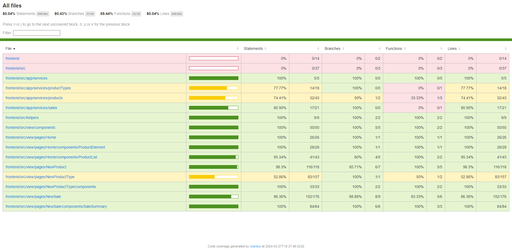
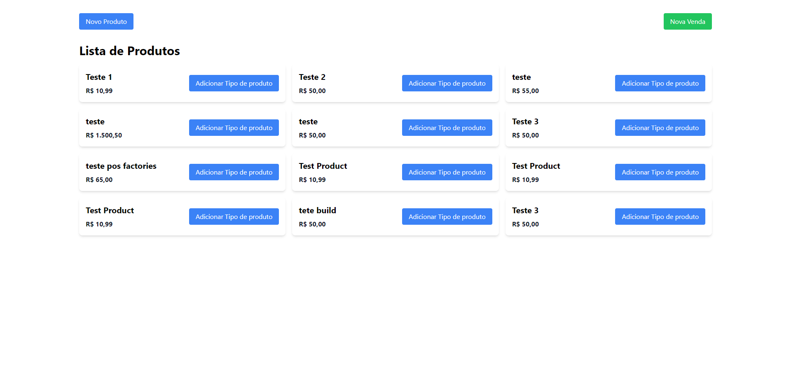
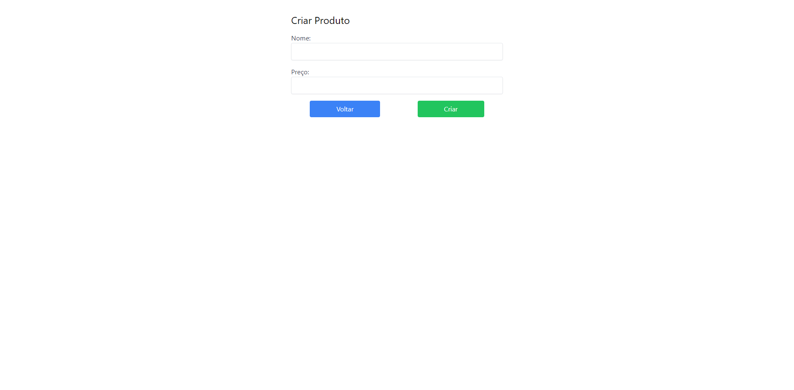
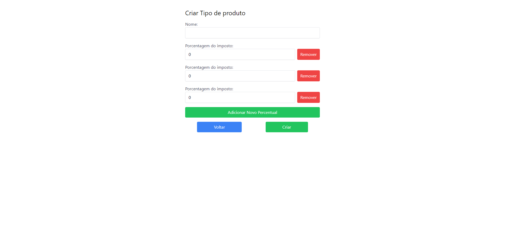
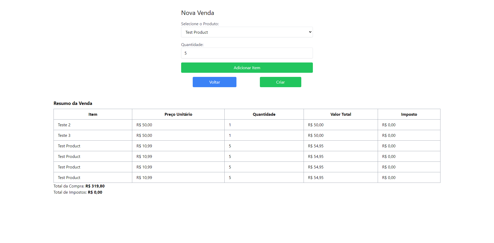

# Frontend

## Como resvolvi o problema

Utilizei o React com typescript e tailwind para criar as telas.

Criei componentes separados, aloquei a lógica para custom hooks e utilizei camada de service para comunicar com a API.

## Como Executar (Com Docker)

Disponibilizei o build como pedido no teste, esta na raiz do projeto frontend, pasta dist/

Para executar é possível utilizar o docker para expor um server node.

Clonar este projeto em algum diretório e mudar para pasta frontend

```console
cd frontend
```
Execute o docker container

```console
docker-compose up -d
```

A aplicação estará disponível em

```console
http://localhost:3030/
```

## Como Executar Sem Docker

Caso não tenha o docker podera utilizar alguma biblioteca que exponha um servidor node, exemplo: http-server

Neste caso tenha o http-server instalado globalmente.

```console
http-server -p 3030 ./dist
```

A aplicação estará disponível em

```console
http://localhost:3030/
```

## Como Executar Desenvolvimento

Também é possível executar o código em desenvolvimento.

```console
npm ci && npm run dev
```

### Testes automatizados

Criei testes automatizados para os componentes das paginas e para seus custons hooks

Para executar (certifique de ter instalado os pacotes necessários):

```console
npm run test
```
<p align="center">
    
</p>

## Telas

### Home

<p align="center">
    
</p>

### Criar Produto

<p align="center">
    
</p>

### Criar tipo de produto e impostos

<p align="center">
    
</p>

### Criar Venda

<p align="center">
    
</p>

